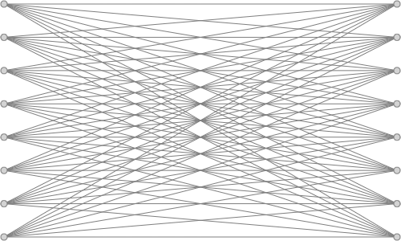
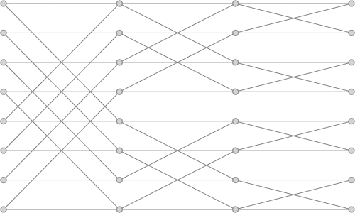
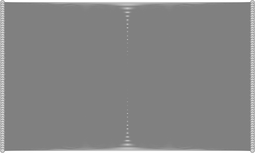
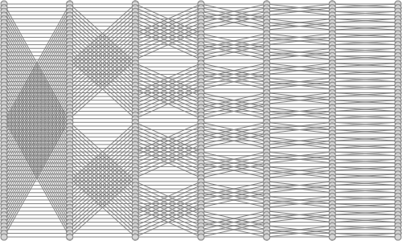

A PyTorch implementation of an agent.

## Files

- Basic:
  - `webenv.py`: a Python bridge to `webenv.js`.
  - `recurrent.py`: RNN training. (Backpropagation-through-time and synthetic gradient.)
- Replaceable:
  - `ldl.py`: linearithmic (time and space) dense layers. (For handling big inputs & outputs with neither quadratic scaling nor assumptions about structure.)
  - `reinforcement_learning.py`: maximization code, for non-prediction goals. (Mostly by modeling the reward and maximizing the model's output.)
  - `main.py`: putting it all together.

Unimplemented: save/load; multiple agents with the same model (which would reduce variance and make learning easier). Also opinions: sparsity (to make [low-dimensional representations](https://arxiv.org/abs/1906.10720) high-dimensional by combining many); [Transformers](https://arxiv.org/abs/2103.03206); non-loss [exploration reward](https://arxiv.org/abs/2101.09458) to [optimize](http://proceedings.mlr.press/v32/silver14.pdf); experience replay; [GAN losses](https://phillipi.github.io/pix2pix/); [BYOL variants](https://openreview.net/pdf?id=bgQek2O63w) (for self-compression, for example, of actions); literally anything else (use your imagination and/or ML expertise).

## Tutorial

If you ever woke up in the middle of the night to think, "damn, I **need** to know how to run this PyTorch example!" — well, you are in luck!

First, make sure to have [Python](https://www.google.com/search?q=install+python) (90 MB) and [PyTorch](https://www.google.com/search?q=install+pytorch) (1.2 GB) installed.

Optionally, install [TensorBoard](https://www.google.com/search?q=install+tensorboard), to be able to create and view those loss plots. Pretty bad software though, would not recommend.

Then, launch `main.py` in this directory:

```bash
python main.py
```

To stop it, press Ctrl+C, or pour lava on your computer. On stopping, exceptions are normal, though not during runtime (if there are, you are seeing a bug that we have not figured out a solution to).

If you want, modify hyperparameters in `main.py` (such as `tensorboard`), and/or copy this folder to another place and modify `webenv_path` at the bottom of `main.py` appropriately.

This marks the end of this tutorial.

## Results

Video prediction with agency is hard, but possible.

TODO: Put a screenshot here. ("Mouse & keyboard were disabled." "Right-side are predictions; it's normal for them to be delayed." "The orange line is with an exploration bonus; the red line is acting via a simple slice of internal state. As you can see, exploration is broken.")

Predictions are blurry, and loss is relatively high. Video prediction is not solved, only poked.

Not satisfied? Perfect: implement your own ideas on your big computer.

[Here are some LSTM tricks for slightly better handling of learning-through-time, for example.](https://www.niklasschmidinger.com/posts/2020-09-09-lstm-tricks/)

## Bonus

A comparison between vanilla dense layers and linearithmic dense layers, which should be enough to explain everything:

<p style="text-align:center">
  <p style="margin:0 auto; display:table">
    
    
  </p>
  <p style="margin:0 auto; display:table">
    
    
  </p>
</p>