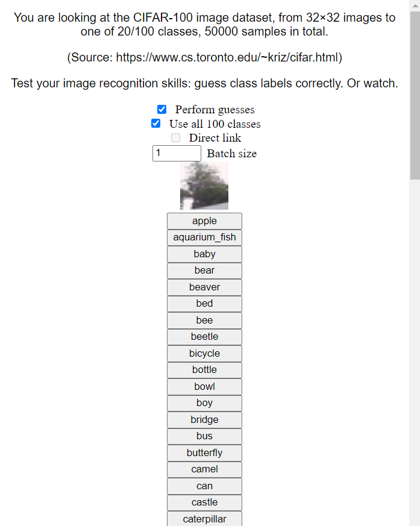

This is the directory that contains dataset installers.

Datasets are a very natural way to learn data, and test its comprehension. Just look at this:

<p style="text-align:center">
    
    
</p>

# Installing

Big data is big. Download it separately if needed, via:

```bash
npm explore webenv -- npm run install-datasets
```

Say "yes" to all the datasets. Especially if you do not have enough storage capacity. Though you may have to download particular decompression utilities.

If installation is interrupted, simply start it again.

# Using

Once finished, the installation process will tell the `file:` URL; use that.

Alternatively, create an HTTP/S dataset server:

```bash
npm explore webenv -- npm run serve-datasets
```

(See `serve-datasets.js` in this folder for details on configuration.)

# Contributing

If you want to include a dataset/environment not covered here, add it.

Guidelines:
- Do not duplicate already-available data. Do not include entire datasets, create dataset installers instead.
- Include a text description of what the dataset is. With natural language understanding, this can help agents remember the correct behavior.
- Try to include both a visual mode and a `directLink` mode, switched by a checkbox.
    - To move the environment at the agent's pace (but not stalling to wait for each step), use `await new Promise(requestAgentStep)`:
```js
function requestAgentStep(callback) {
    const f = requestAgentStep
    if (typeof directLink == 'function' && !f.cb)
        f.cb = [], directLink(() => f.cb.splice(0, f.cb.length).forEach(f => f()) || true)
    f.cb ? f.cb.push(callback) : setTimeout(callback, 200)
}
```
- To coerce self-determination into learning particular behaviors, make being wrong boring: try only allowing non-trivial outcomes for correct answers, as games do. Incorrect answers would then require less representational volume to predict, making correct answers more likely to be selected, which would reinforce reasons-to-be-correct, which would make correct answers likelier.
- A dataset is nice, but a dataset with pre-trained model/s is nicer.
    - With self/supervised learning (data with or without labels), include a pre-trained model's output as a part of either data or label.
        - For learning a generative model of the world, it should not matter whether the label (if any) is shown after the data or with the data.
    - Reinforcement learning (observations, actions, rewards):
        - Allow switching who plays the game with a checkbox.
            - For self-determination: both read and write all the information needed for a decision (per-action Q-values and policies), and have a checkbox that switches whether to read or write that (if reading, mask everything for prediction). Hard but fair: the main agent can compare how well it does against an auto-agent, and learn everything about why the auto-agent makes its decisions. With many such examples, coherent behavior is easier to remember and thus easier to choose to use.
            - (Simple memorization is explicitly forbidden: `directLink` has no way to read predictions.)
- For throughput: if fetching random samples (often data+label), do not wait for `fetchSlice` each time; instead, fetch into an in-memory buffer asynchronously, and sample from that buffer.

Installation is simply an extensible copy operation, from `tools/data` to `data`.

Data itself is not included with these data interfaces, because it is as large as your mother. However, we do include how to get data: `INSTALL.js` will get executed on installation if present, and should download and extract all the data.

All datasets must contain `main.html`.

(In addition, the file `SIZE` may contain the file size, so that users know what to not install.)

Installation for already-installed datasets will copy non-downloaded files without running `INSTALL.js`, so that updating code is easy.

If details are unclear, see pre-existing datasets.