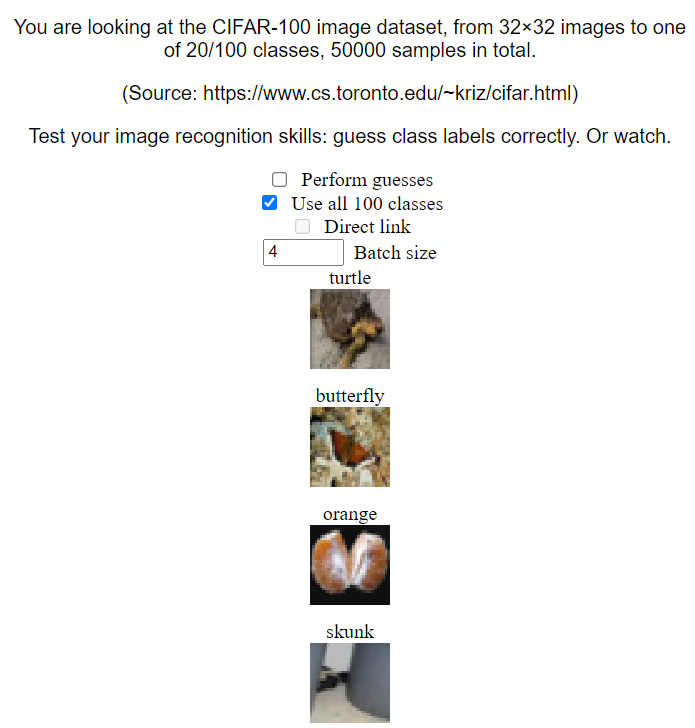
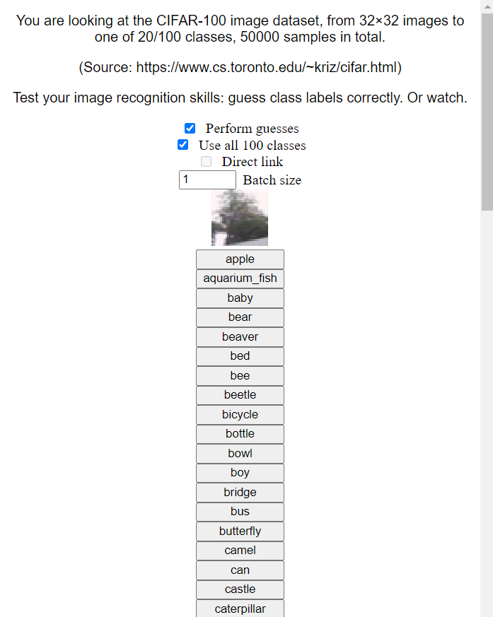

This is the directory that contains dataset installers.

Datasets are a very natural way to learn data and test its comprehension. Just look at this:

<p style="text-align:center">
    
    
</p>

Extremely natural.

More usefully, the `RandomURL` dataset provides a uniform interface for randomly sampling the Web (that was visited by Common Crawl). If you are interested what other datasets are, use some Web search engine.

# Installing

Big data is big. Download it separately if needed, via:

```bash
npm explore webenv -- npm run install-datasets
```

Say "yes" to all the datasets. Especially if you do not have enough storage capacity.

If installation is interrupted, simply start it again.

In the end, you should see "OK".

# Using

Once finished, the installation process will report the `file:` URL; use that.

Alternatively, launch an HTTP/S dataset server for manual inspection:

```bash
npm explore webenv -- npm run serve-datasets
```

(See `serve-datasets.js` in this folder for details on configuration.)

# Contributing

If you want to use a dataset/environment not covered here, add it.

Installation is simply an extensible copy operation, from `tools/data` to `data` and executing `INSTALL.js` if present.

Guidelines:
- Basic:
    - Do not include entire datasets, create dataset installers instead, which [`download` already-available data](docs/download.js). If you can, include the file `SIZE` with only the byte-count of the downloaded data.
    - In `main.html`, do not read entire datasets into memory at once. Instead, [use `fetchSlice`](docs/fetchSlice.js).
        - For throughput: if fetching random samples (often data+label), do not wait for `fetchSlice` each time. Instead, fetch into an in-memory buffer asynchronously, and sample from that buffer.
    - To move the environment at the agent's pace without waiting for each step to complete, [use `await new Promise(requestAgentStep)`](docs/requestAgentStep.js).
- Optional:
    - To help agents with natural language understanding, include a text description of what the dataset is on the main page.
    - To combine curiosity and complexity with being right, make being right have more depth: only allow non-trivial outcomes for correct answers, as games do. In addition to any unpredictability bonuses, correct answers would then receive more gradient, and vary more and cover more and thus get selected easier.
    - Try to `directLink` other models wherever you can: data is nice, but data with a teacher is nicer.
        - With self/supervised learning (data with or without labels), include a pre-trained model's output or internal state as a part of either data or label.
            - (For learning a model of the world, it should not matter whether the label (if any) is shown after the data or with the data.)
        - With reinforcement learning (`directScore`): allow switching auto-playing on with a checkbox or periodically, and directly link all the auto-model's outputs when it plays, so that coherent behavior is very easy to choose to use even when not auto-playing.
            - (Accessing the agent's memorization is explicitly forbidden: `directLink` has no way to read predictions. No copyright issues.)
    - If you do not trust web pages and want ML-like IO: include both a visual mode and a `directLink` mode, switched by a checkbox or periodically.

All datasets must contain `main.html`, and may contain `INSTALL.js` and `SIZE`.

Installation for already-installed datasets will copy non-downloaded files without running `INSTALL.js`, so that updating code during development is easy.

If details are unclear, see pre-existing datasets.

Currently, `serve-datasets` only handles static pages with `fetchSlice` and does not allow launching servers on request, so, for example, Gym integration is not supported here. (There has been no demand.)